# Virtual-Physical Mars City

*A Mars city digital twin closing the loop: real HiRISE terrain → WebXR city →
simulation-backed engineering → a real chip running the city's AI.*

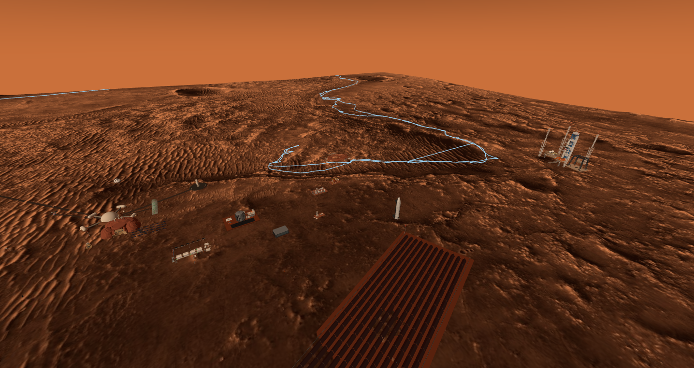

Starting from real NASA HiRISE terrain (Jezero Crater, 1 m/px), this project
builds a Mars city digital twin in the browser: 20+ procedurally modeled
facilities, 124 knowledge cards each backed by simulation, a live Perseverance
mission layer, and day/night driven by true Martian solar time — plus a compute
center that closes the **real world → digital twin → AI → silicon** loop:
a character-level bigram language model runs live on the big screen, and the
same algorithm exists as a real chip (full sky130 GDS flow + a fabbed PCB)
seated in the rack beside it.

## Quick start

```
python -m http.server 8123        # from the repo root
# open http://localhost:8123/viewer/
```

On Windows, double-click `启动火星VR.bat` (auto-ingests new models, refreshes
Perseverance mission data, starts the server, opens the browser). three.js is
bundled (MIT). A WebXR-capable browser can hit Enter VR for immersive mode.

Keys: `WASD` move · `F` fly · `V` inspect a facility (with action buttons,
e.g. Launch) · `M` orbit view · `E` enter the undercity · `P` teleport to
Perseverance · bottom-right slider scrubs Martian time.

## What's in town

| System | Highlights |
|---|---|
| Power | Tokamak fusion plant (390 MWe) + 429 m waste-heat radiator field (600 K radiative balance closes) + storage farm with an L0–L3 sim chain |
| Rockets | Starship (entry corridor / plume / TPS double-checked) + CZ-10B (net-catch recovery, Monte-Carlo N=500, 100% capture) — one launch every sol |
| Science | SPAD atmospheric LiDAR (5.1 km day / 15 km night link budget) + optical observatory (512×512 SPAD focal plane) + a MiniPAN magnetic spectrometer riding the relay sat |
| Comms | 3+1 areostationary constellation (a six-track sim loop: full-wave antenna / radiation transport / thermoelastics / orbit integration / queueing / coding MC) + a 12 m deep-space ground station |
| Resources | Rodwell ice well (Stefan-checked 669-sol well life) + Sabatier propellant plant + regolith 3-D print site |
| Undercity | Walk-through foyer (city-cavern diorama) + a PET/CT clinic (GATE MC reconstruction — the patient is a robot) |
| Perception | The mine robot navigates by sight through a declarative sensor channel: engine offscreen render → CIS CMOS imaging model → 5 Hz perceive-and-control loop |

## Posters

| | |
|---|---|
| 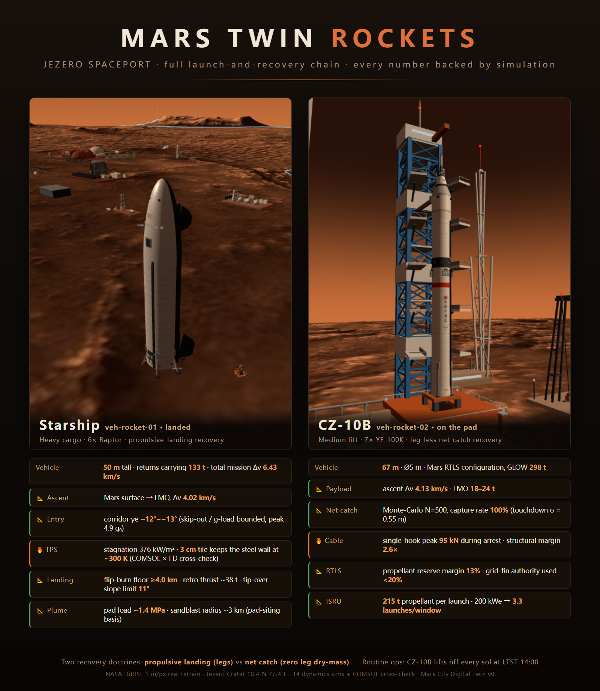 | 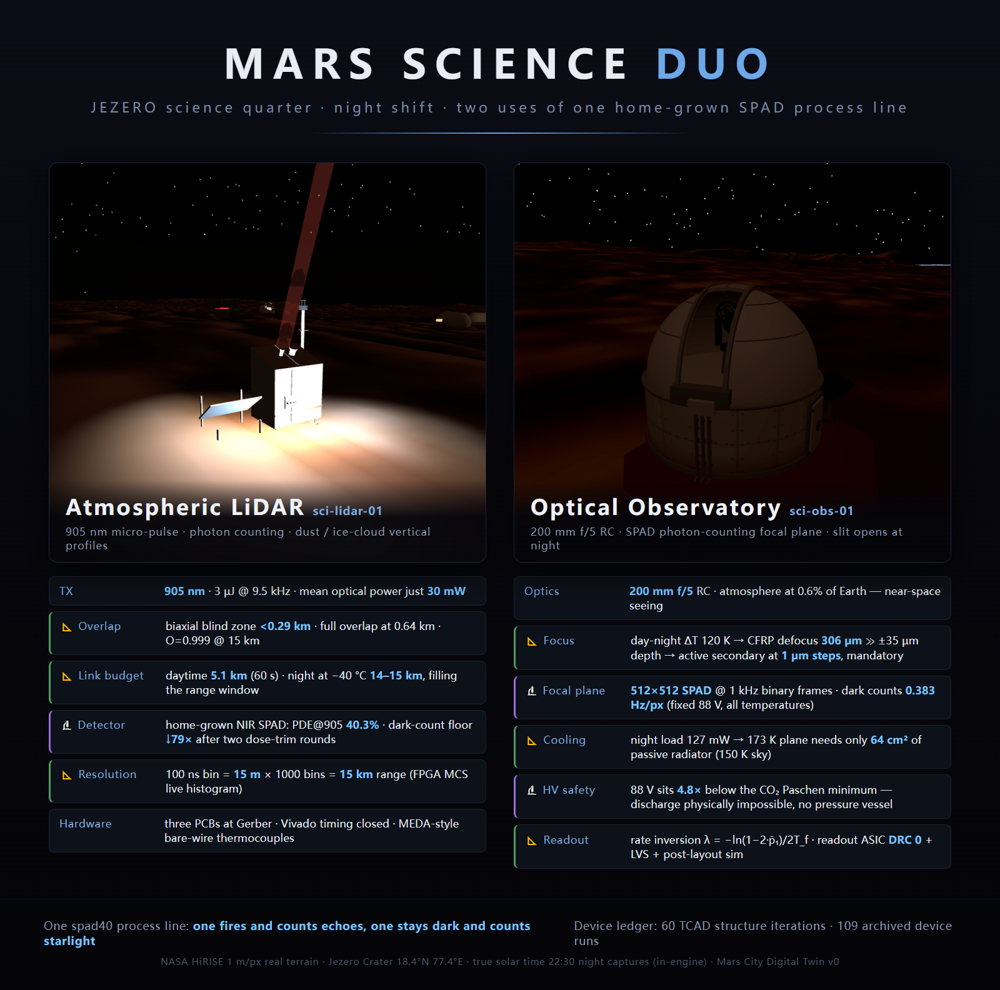 |
| 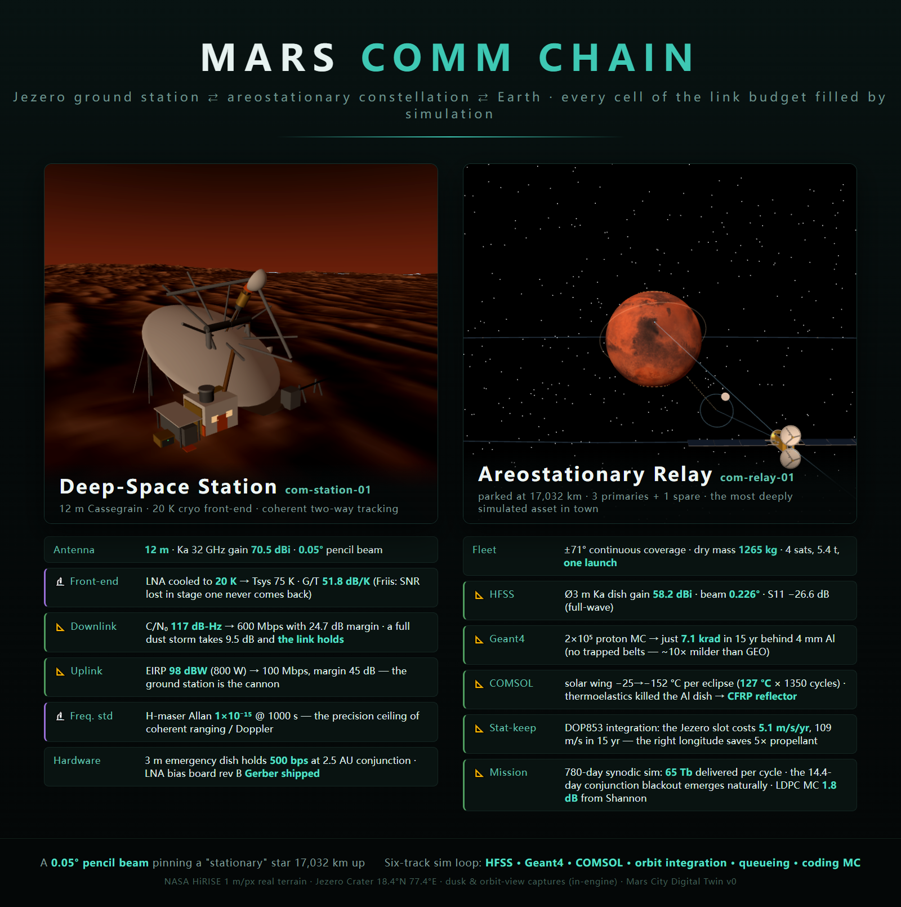 | 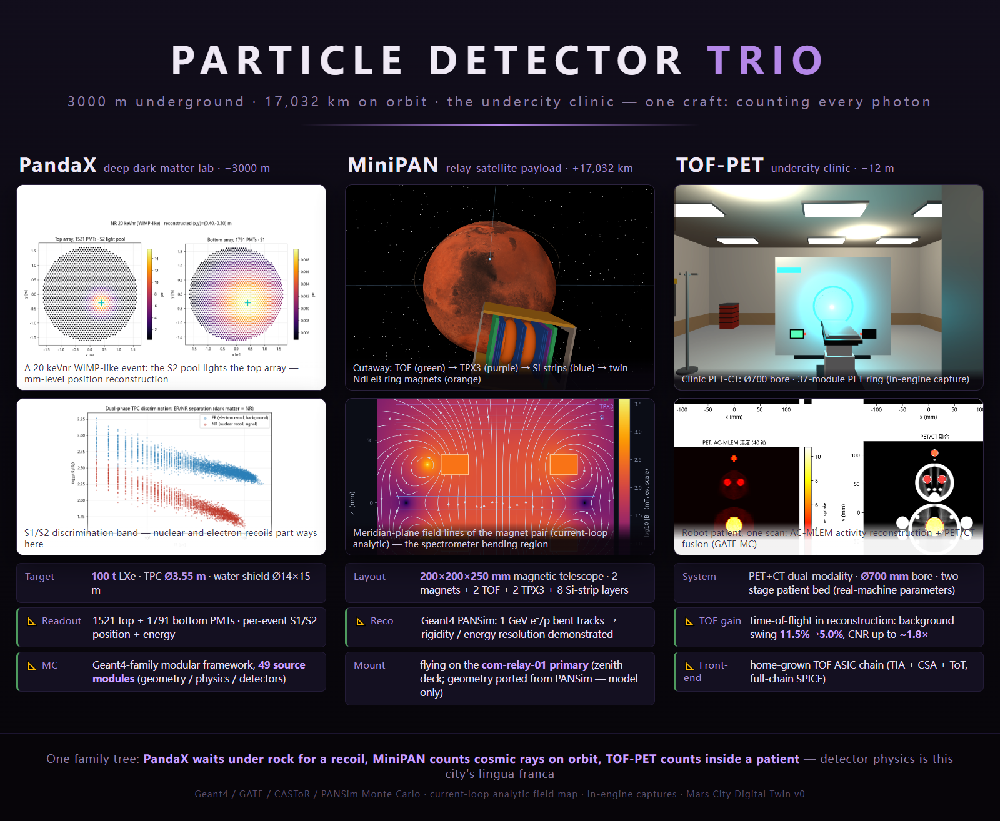 |
| 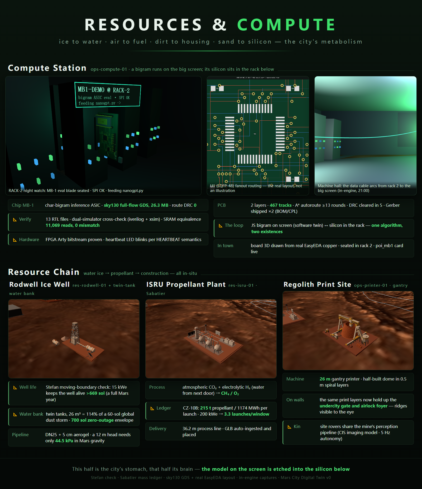 | 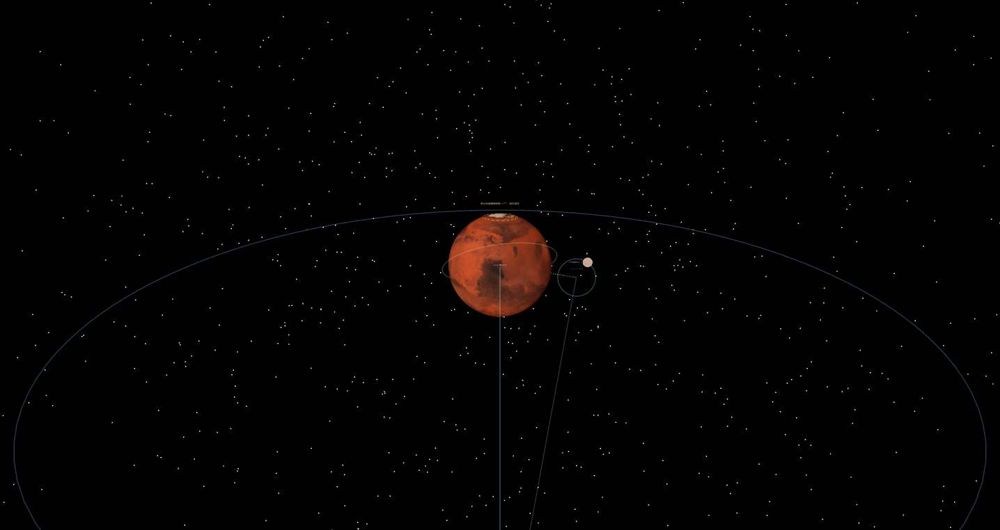 |
| 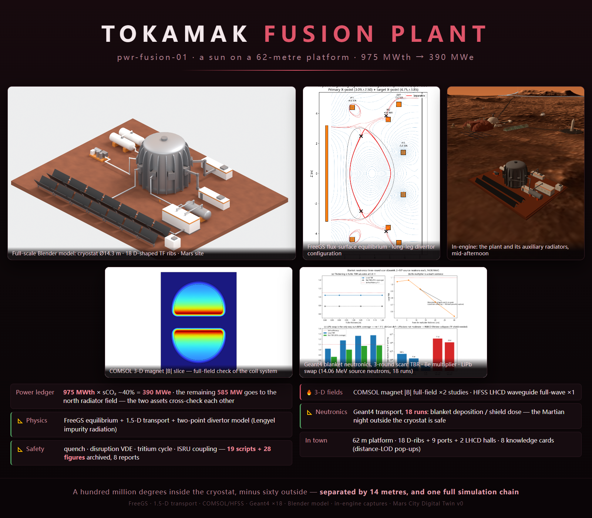 | 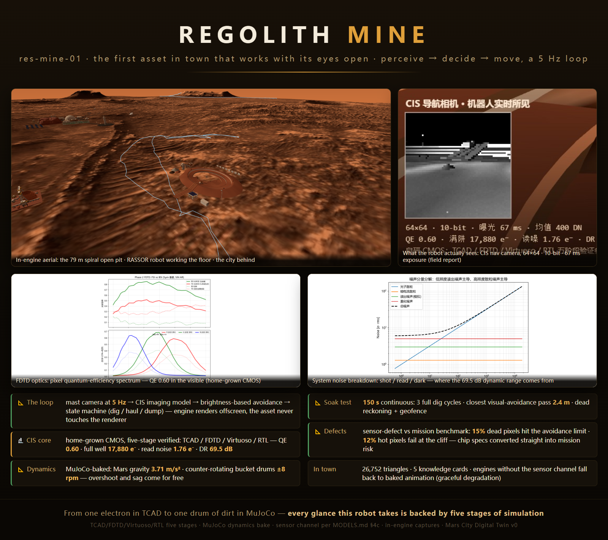 |
| 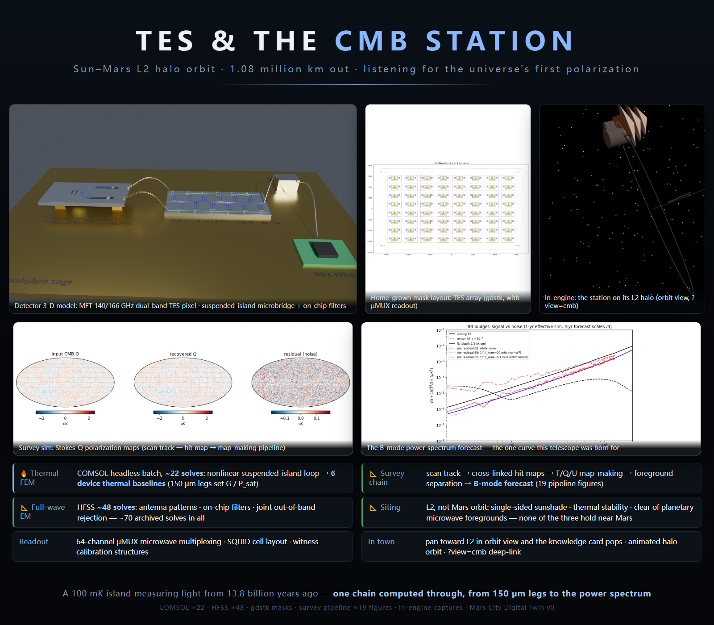 | 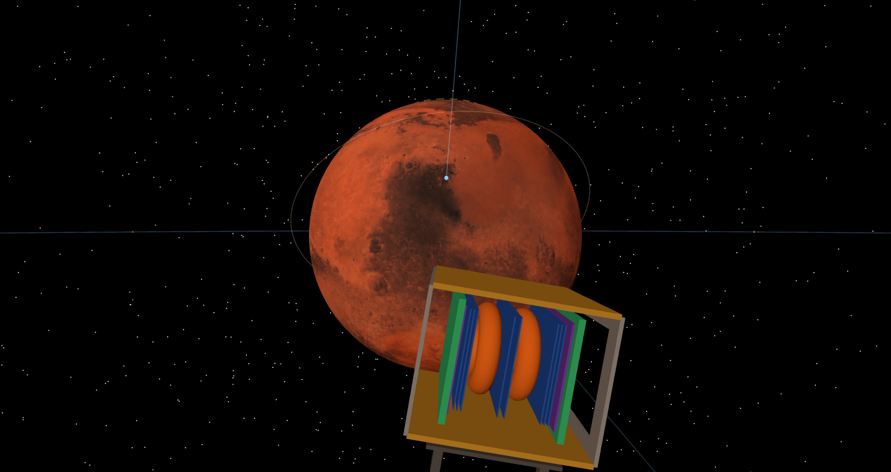 |

## Layout

- `viewer/` — the engine (main.js) + 21 procedural asset modules + knowledge-card info.json
- `scripts/` — data pipelines (HiRISE download / terrain processing / mission
  updates / model ingestion) + 14 rocket dynamics sims + layout-audit and
  contract-validation tools
- `models/` — GLB assets and the manifest
- `data/processed/` — finished terrain (raw HiRISE re-fetched on demand by `scripts/download_data.py`)
- `snaps/` — posters and captures (HTML sources included, re-renderable)
- `extras/tof-pet/` — PET shell model + GATE→MLEM reconstruction chain + the robot-patient scan
- Collaboration contracts and progress: `MODELS.md` · `CHECKLIST.md` ·
  `STATUS.md` · `SENSOR_SPEC.md` · `EQUIPMENT.md` (in Chinese — they are the
  working documents of the build)

The city was built by multiple AI sessions working in parallel: a lead session
maintains the engine and the contracts (MODELS.md), design sessions deliver
asset modules and knowledge cards against those contracts, and tooling keeps
quality honest (SAT overlap audit, contract validation, runtime verification).

## Scope boundaries (deliberate)

1. **Commercial-tool simulations (Sentaurus TCAD / COMSOL / ANSYS HFSS, etc.)**:
   only the final Python plotting scripts and exported data are included — no
   commercial project/model files. Outputs of free/open toolchains (Blender,
   EasyEDA, Geant4/GATE, CASToR, Yosys/OpenROAD, ...) are included as-is.
2. **TOF-PET**: only the shell model, the reconstruction algorithms and the
   robot-patient scan. Detector and front-end electronics design are out of scope.
3. **Dark-matter experiment & MiniPAN**: their Monte-Carlo / simulation source
   code lives in separate projects and is not in this repository — the city
   carries only 3-D asset modules and result images.

## Data sources & credits

- Terrain: NASA/JPL/University of Arizona — HiRISE DTM & orthoimage
- Mission data: NASA Mars 2020 (Perseverance) public API, refreshed at launch
- Martian time: our own implementation of the Allison & McEwen (2000) ephemeris

## License

Code: MIT · assets/documentation: CC BY 4.0 — see [LICENSE](LICENSE).
Third-party components in [THIRD_PARTY_NOTICES.md](THIRD_PARTY_NOTICES.md).
